## 模块业务流程 Mermaid 汇总

### 模块 1：Overview 总览

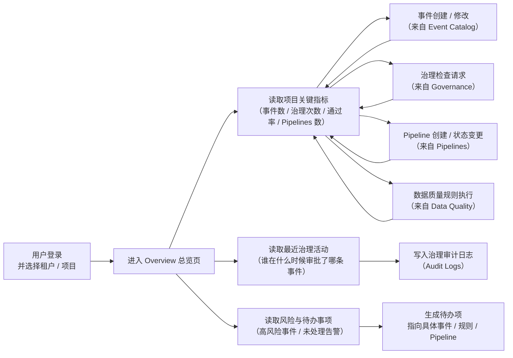

### 模块 2：Event Catalog（事件目录）

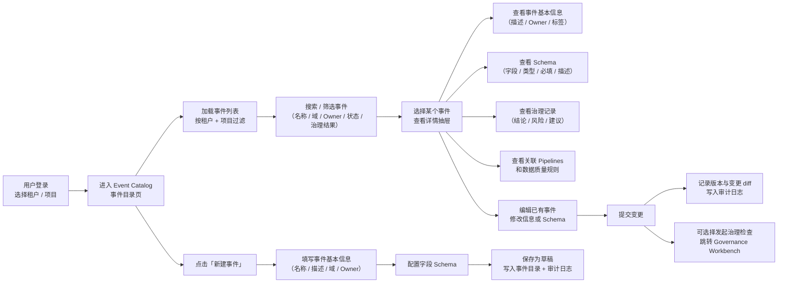

### 模块 3：Governance（治理工作台）

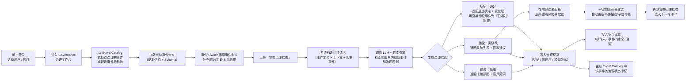

### 模块 4：Pipelines（数据通路）

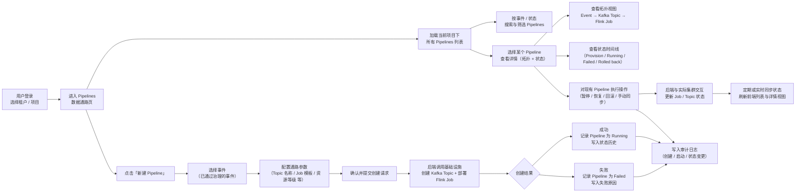

### 模块 5：Data Catalog（数据资产目录）

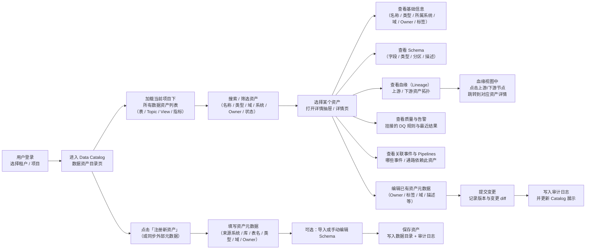

### 模块 6：Data Quality（数据质量）

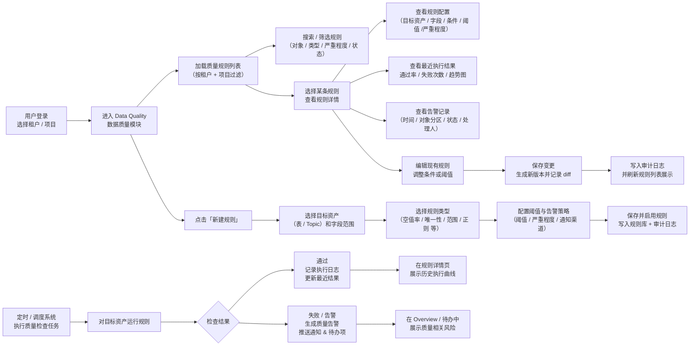

### 模块 7：Scheduler（任务编排）

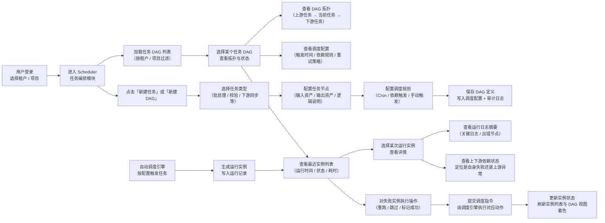

### 模块 8：Explore（查询工作台）

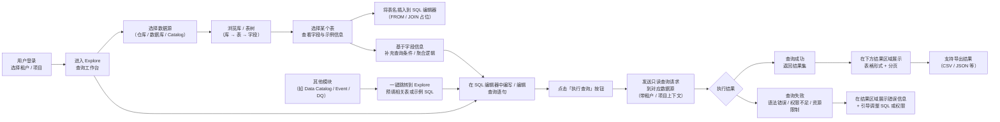

### 模块 9：Infrastructure（基础设施概览）

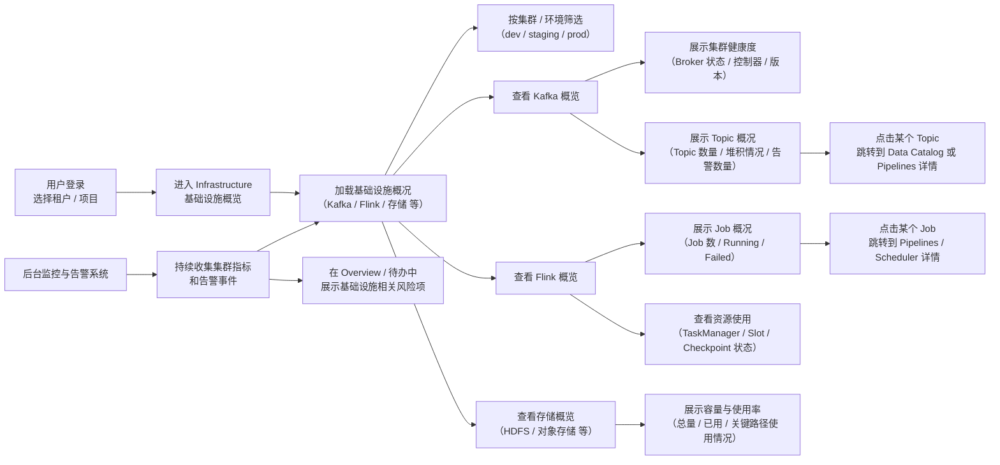

### 模块 10：Audit Logs（审计日志）

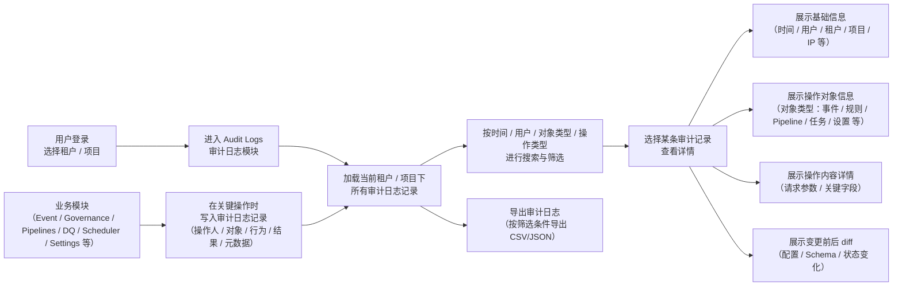

### 模块 11：Settings（项目与系统设置）

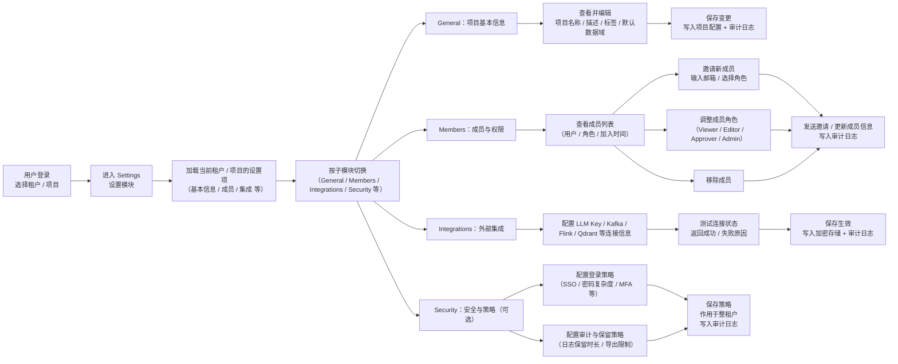

### 模块 12：Auth + Tenant / Project（登录 & 租户/项目选择）

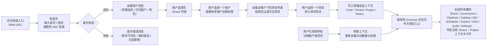

### 模块 13：Monitoring & Alerts（监控与告警中心）

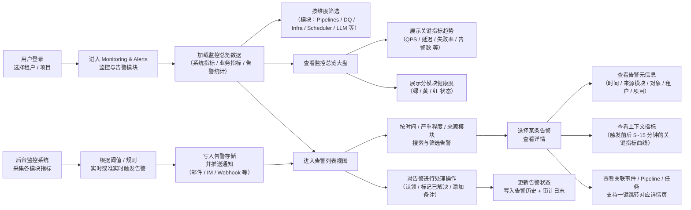

### 模块 14：Collaboration & Workflow（协作与流程中心）

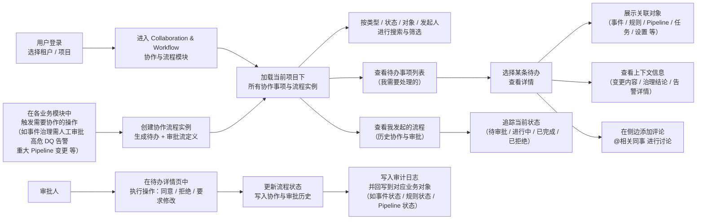

### 模块 15：Knowledge & Documentation Center（知识与文档中心）

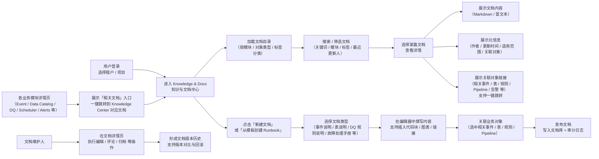

### 模块 16：Cost & Usage Analytics（成本与资源用量分析）

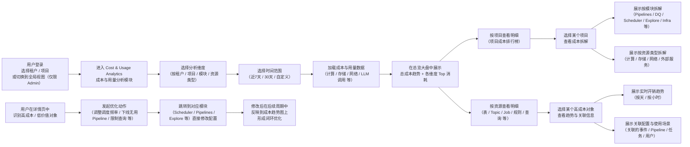

### 模块 17：Sandbox & Experimentation（沙箱与实验中心）

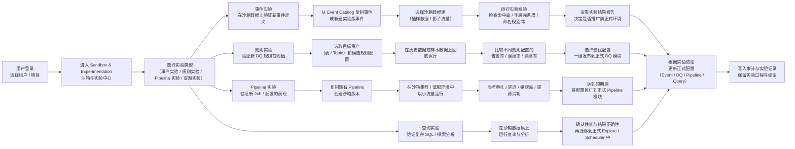

### 模块 18：Integration Hub（集成与接入中心）

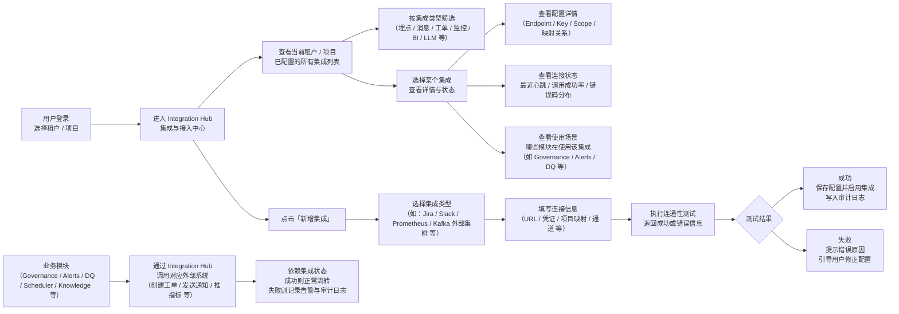

### 模块 19：User & Access Management（用户与访问控制）

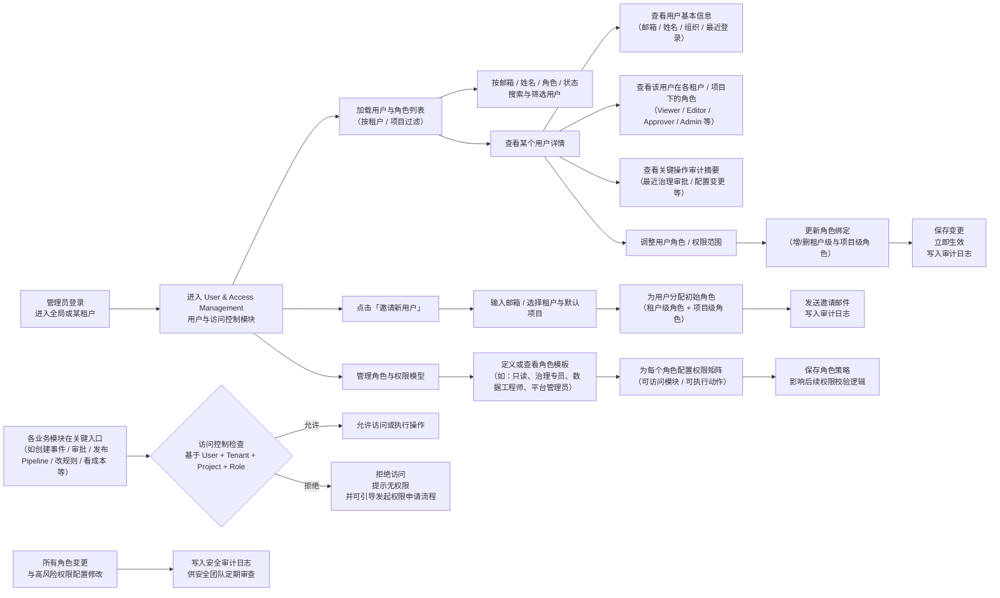

### 模块 20：Policy & Rule Center（策略与规则中心）

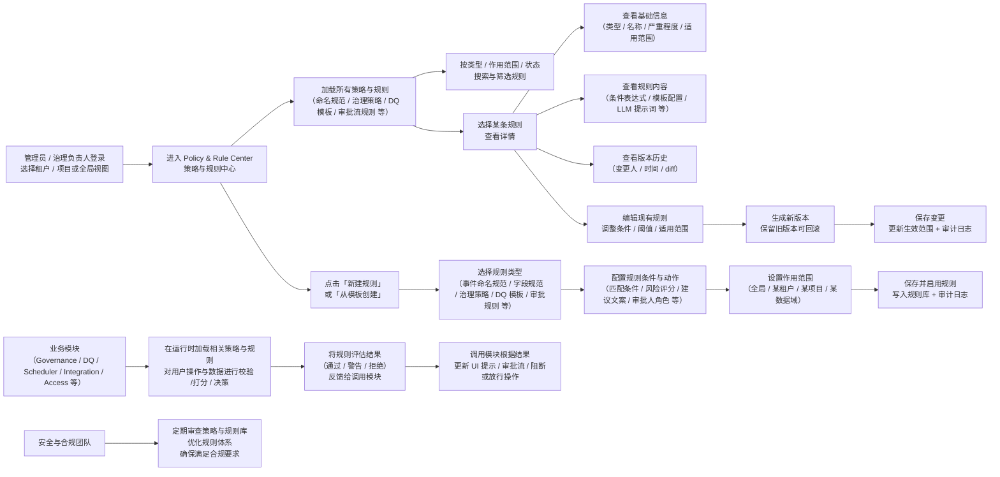

### 模块 21：Ingestion & SDK Center（接入与 SDK 中心）

```mermaid
flowchart LR
  A["用户登录\n选择租户 / 项目"] --> B["进入 Ingestion & SDK Center\n接入与 SDK 中心"]

  B --> C["查看当前项目的\n接入通道与 SDK 配置列表"]
  C --> D["按平台 / 应用 / 环境\n（Web / iOS / Android / Server / Prod / Staging）\n搜索与筛选"]

  C --> E["选择某个接入配置\n查看详情"]
  E --> F["查看基础信息\n（平台 / 应用ID / 环境 / 状态）"]
  E --> G["查看上报 Endpoint\n（域名 / 路径 / 认证方式）"]
  E --> H["查看 SDK 配置\n（版本 / 采样率 / 开关项 / 阻断规则）"]
  E --> I["查看快速接入指南\n代码示例 / 配置片段 / SDK 下载链接"]

  B --> J["点击「新建接入配置」"]
  J --> K["选择平台与环境\n（如：Web + Staging）"]
  K --> L["生成或填写\n应用标识 / 密钥 / 上报域名 等"]
  L --> M["设置采样率与开关\n（全量 / 按比例 / 仅特定事件）"]
  M --> N["保存配置\n生成接入 Key 与示例代码\n写入审计日志"]

  E --> O["编辑现有接入配置\n调整采样率 / 阻断列表 / 开关状态"]
  O --> P["保存变更\n立即作用于新会话\n写入审计日志"]

  Q["客户端 / 服务端应用\n集成 SDK 后"] --> R["按照配置将事件\n上报到 Ingestion 入口"]
  R --> S["接入网关\n进行鉴权 / 限流 / 基础校验"]
  S --> T["合格数据进入\n事件处理与 Pipeline\n（进入 Event / Governance / DQ 等后续链路）"]
  S --> U["异常数据被丢弃或打回\n记录错误与告警\n可在 Monitoring 中查看"]
```

### 模块 22：Release & Change Management（发布与变更管理）

```mermaid
flowchart LR
  A["用户登录\n选择租户 / 项目"] --> B["进入 Release & Change Management\n发布与变更管理模块"]

  B --> C["加载所有变更单\n（按类型 / 状态 / 发起人 / 时间）"]
  C --> D["筛选查看\n待审批 / 进行中 / 已完成 / 已回滚 的变更"]

  C --> E["选择某个变更单\n查看详情"]
  E --> F["展示变更对象\n（事件 / DQ 规则 / Pipeline / 任务 / 策略 等）"]
  E --> G["展示变更内容 diff\n（前后配置对比）"]
  E --> H["展示关联风险评估\n（自动检查 + 人工评审结论）"]
  E --> I["展示变更计划与窗口\n（生效时间 / 回滚预案）"]

  J["在各业务模块中\n发起重要变更\n（如新规则上线 / Pipeline 修改 等）"]
    --> K["创建变更请求\n自动带上对象与diff"]
  K --> L["指定审批流与影响范围\n（涉及租户 / 项目 / 域）"]
  L --> M["提交后进入待审批状态\n写入变更中心"]

  N["审批人"] --> O["在变更详情页中\n执行：同意 / 拒绝 / 退回修改"]
  O --> P{"审批结果"}
  P --> Q["同意\n按计划时间执行发布\n并监控发布过程"]
  P --> R["拒绝或退回\n更新状态并通知发起人"]

  Q --> S{"发布执行结果"}
  S --> T["成功\n记录最终配置与版本\n标记变更完成"]
  S --> U["失败\n触发自动或手动回滚\n恢复到上一个稳定版本"]

  T --> V["写入发布审计日志\n供合规与复盘使用"]
  U --> V
```

### 模块 23：Custom Reports & Dashboard Builder（自定义报表与看板构建）

```mermaid
flowchart LR
  A["用户登录\n选择租户 / 项目"] --> B["进入 Custom Reports & Dashboard Builder\n自定义报表与看板模块"]

  B --> C["加载当前项目下\n已有报表与看板列表"]
  C --> D["按创建人 / 标签 / 应用场景\n搜索与筛选"]

  C --> E["选择某个报表 / 看板\n查看与使用"]
  E --> F["查看看板布局\n多个图表组件：折线 / 柱状 / 表格 等"]
  E --> G["按时间 / 维度 / 筛选条件\n交互式探索数据"]
  E --> H["保存个性化视图\n或导出为图片 / PDF / 链接"]

  B --> I["点击「新建看板」或「新建报表」"]
  I --> J["选择模板或从空白开始\n（运营监控 / 质量监控 / 成本分析 等）"]
  J --> K["在画布中拖拽图表组件\n（指标卡 / 趋势图 / 分布图 / 表格 等）"]
  K --> L["为每个组件配置数据源与查询\n（关联 Event / Pipeline / DQ / Cost 等数据集）"]
  L --> M["配置筛选条件 / 刷新频率 / 权限范围"]
  M --> N["保存并发布看板\n写入配置库 + 审计日志"]

  O["看板拥有者"] --> P["管理分享与权限\n（公开给项目成员 / 仅特定角色 / 链接访问）"]
  P --> Q["控制谁能查看 / 编辑 / 克隆该看板"]

  R["后台查询与缓存层"] --> S["按看板配置\n周期性预计算或缓存结果"]
  S --> F
```

### 模块 24：Data Product Marketplace（数据产品市场）

```mermaid
flowchart LR
  A["用户登录\n选择租户 / 项目"] --> B["进入 Data Product Marketplace\n数据产品市场"]

  B --> C["加载当前项目下\n所有数据产品列表"]
  C --> D["按状态 / 负责人 / 域 / 标签\n搜索与筛选"]

  C --> E["选择某个数据产品\n查看详情"]
  E --> F["查看产品信息\n（Schema / 资产绑定 / SLA / 可见性）"]
  E --> G["查看版本历史\n（变更人 / 时间 / 快照）"]
  E --> H["查看订阅列表\n（申请中 / 已批准 / 已拒绝 / 已撤销）"]

  B --> I["点击「新建数据产品」"]
  I --> J["填写产品元信息\n（名称 / 域 / 类别 / 标签 / 描述）"]
  J --> K["配置产品契约\n（Schema / 关联资产 / SLA / 访问策略）"]
  K --> L["保存草稿或直接发布\n写入产品库 + 审计日志"]

  M["消费者"] --> N["发起订阅申请\n填写申请原因与配额需求"]
  N --> O["生成订阅申请\n状态=待审批"]

  P["审批人"] --> Q["审批订阅\n同意 / 拒绝 / 取消 / 撤销"]
  Q --> R{"审批结果"}
  R --> S["同意\n签发访问令牌\n设置有效期与配额"]
  R --> T["拒绝或取消\n更新申请状态并记录原因"]

  S --> U["使用令牌访问产品数据\n进入下游分析/报表流程"]
  Q --> V["写入订阅与权限审计日志"]
  L --> V
```

### 模块 25：Incident Response & Runbook Center（事故响应与 Runbook 中心）

```mermaid
flowchart LR
  A["用户登录\n并选择租户 / 项目"] --> B["进入 Incident Response Center"]

  B --> C["读取 Incident 总览指标\n(total/open/investigating/mitigated/resolved/closed + MTTR)"]
  B --> D["读取 Incident 列表\n(按 status/severity/owner/assignee/source 过滤)"]
  B --> E["读取最近 Incident 活动\n(来自审计日志)"]

  B --> F["新建 Incident\n(source_type/source_id/title/severity)"]
  F --> G{"权限校验\n(OWNER/ADMIN/EDITOR/APPROVER)"}
  G -->|通过| H["创建 Incident\nstatus=OPEN"]
  G -->|拒绝| X["返回 403"]
  H --> I["写入 Timeline: CREATE"]
  I --> J["写入 Audit: INCIDENT_CREATE"]

  D --> K["选择 Incident\n查看详情 + Timeline"]
  K --> L{"执行 Incident Action"}

  L --> M["TRIAGE / START_INVESTIGATION\n状态迁移到 TRIAGED / INVESTIGATING"]
  L --> N["ASSIGN / ADD_NOTE\n更新 assignee 或补充备注"]
  L --> O["MITIGATE\n更新 impact_payload + mitigated_at"]
  L --> P["RESOLVE\n更新 resolution_payload + resolved_at"]
  L --> Q["CLOSE / REOPEN\n结案或重开"]
  L --> R["LINK_RUNBOOK\n关联 runbook_doc_id"]

  R --> S["查询 Knowledge Docs\n校验 runbook 可用性"]
  S --> R

  M --> T{"状态流转规则校验"}
  O --> T
  P --> T
  Q --> T

  T --> U["写入 Timeline\n(动作、操作者、备注、payload)"]
  N --> U
  R --> U
  U --> V["写入 Audit\n(INCIDENT_* 动作日志)"]

  V --> C
  V --> D
  V --> E
```
